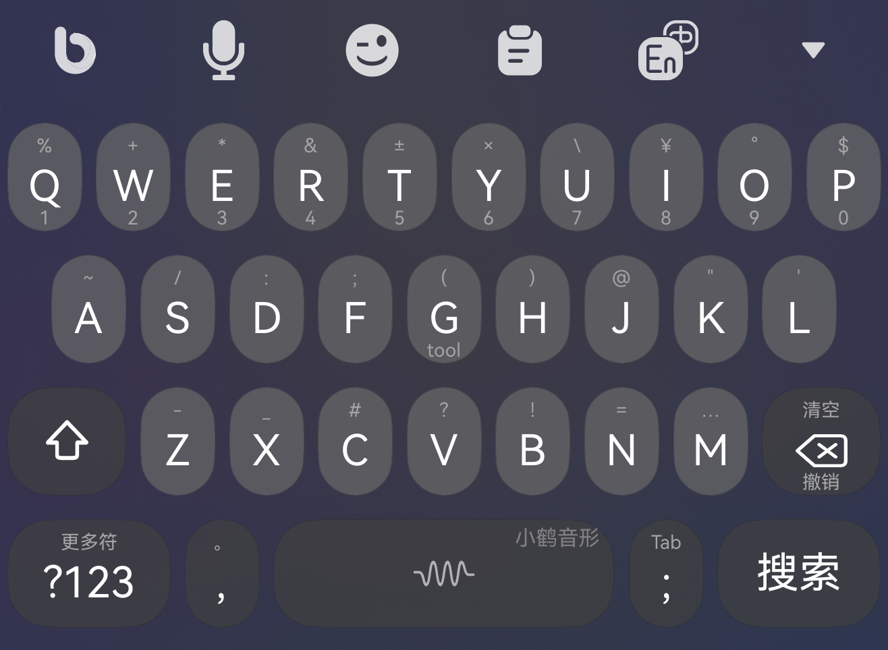

# 超越输入法：

〉https://appgallery.huawei.com/app/detail?id=app.flytype.hmos.bim&channelId=SHARE

# 适配超越输入法5.4版本：

使用方法:

1、克隆项目;

2、将项目打包为.zip格式压缩包;

3、导入超越输入法中可使用主题键盘;

4、如果需要单独导入键盘:将项目中的themes单独进行压缩打包导入即可.

## 主题样式：

 
